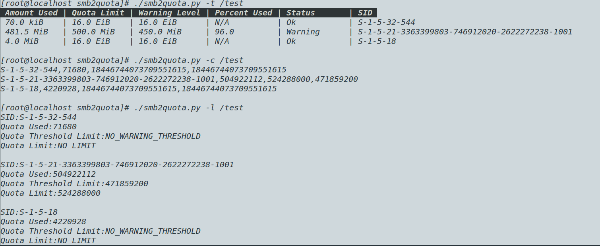

# smb2quota
Userspace helper to display quota information for the Linux SMB client file system (CIFS)

### NOTES
Kernel  support  for  smb2quota requires the `CIFS_QUERY_INFO IOCTL` which was initially introduced in the 4.20 kernel and is only implemented for mount points using SMB2 or above `see mount.cifs(8) vers option`

###  smb2quota recognizes following parameters:
```
$ smb2quota.py -h
usage: smb2quota [-h] [-t] [-c] [-l] <filename>

Please specify an action to perform.

positional arguments:
  <filename>     filename on a share

optional arguments:
  -h, --help     show this help message and exit
  -t, --tabular  print quota information in tabular format
  -c, --csv      print quota information in csv format
  -l, --list     print quota information in list format

```

### Contact : [Kenneth D'souza](mailto:kennethdsouza94@gmail.com) 

 The Linux CIFS Mailing list is the preferred place to ask questions regarding these programs
 
 [linux-cifs ](linux-cifs@vger.kernel.org)
---

### Example



